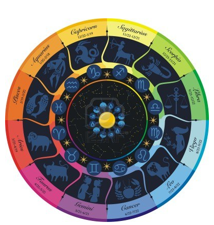
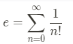

# Go (II)
Condiciones y ciclos

## Objetivo
Hacer uso las condicionales en Go con *if, else-if, switch*.
Hacer uso de los ciclos en Go con *for*

## Descripción
Crear los siguientes programas usando Golang:

### Signo zodiacal
Programa para pedir al usuario el día y mes de nacimiento, y de acuerdo a su día y mes de nacimiento, mostrar en pantalla su signo zodiacal.

| Horóscopo \| Signo del zodiaco |                 Fechas                 |
|:------------------------------:|:--------------------------------------:|
| Capricornio                    | Del 22 de diciembre al 20 de enero     |
| Acuario                        | Del 21 de enero al 19 de febrero       |
| Piscis                         | Del 20 de febrero al 20 de marzo       |
| Aries                          | Del 21 de marzo al 20 de abril         |
| Tauro                          | Del 21 de abril al 21 de mayo          |
| Géminis                        | Del 22 de mayo al 21 de junio          |
| Cáncer                         | Del 22 de junio al 23 de julio         |
| Leo                            | Del 24 de julio al 23 de agosto        |
| Virgo                          | Del 24 de agosto al 23 de septiembre   |
| Libra                          | Del 24 de septiembre al 23 de octubre  |
| Escorpio                       | Del 24 de octubre al 22 de noviembre   |
| Sagitario                      | Del 23 de noviembre al 21 de diciembre |
### Número *e*
Cálculo del Número e:

